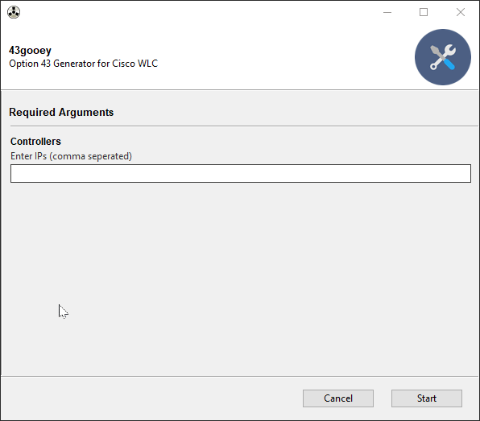

# What is it?
43gooey.py is meant as a quick example of a devops tool using [gooey](https://github.com/chriskiehl/Gooey) as a user interface.  This script allows you to generate option 43 hex strings used by Cisco APs for wireless controller discovery.

# How do I use it?  
__With Pipenv__
```
#!bash
pipenv run 43gooey.py
```
__With installed libraries__
```
#!bash
python3 43gooey.py
```
# How do I install it?

See below.

## Requirements

* Python 3.7
* gooey
 

## Installation

* Clone the repo and use pipenv

```
#!bash
git clone https://bitbucket.org/crvallance/option43-gui.git
cd option43-gui/
pipenv install
pipenv run 43gooey.py
```

## Demo


# ChangeLog

* 1.0.1
	* Initial Release